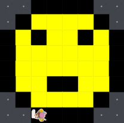

# Unit 1 - Asphalt Art

## Introduction

Cities use asphalt art to improve public safety, inspire their residents and visitors, and brighten communities. Your goal is to create asphalt art to revitalize The Neighborhood and bring the community together with the help of the Painter.

## Requirements

Use your knowledge of object-oriented programming, algorithms, the problem solving process, and decomposition strategies to create asphalt art:
- **Create a new subclass** – Create at least one new subclass of the PainterPlus class that is used for a component of the asphalt art design.
- **Plan an algorithm** – Use the problem solving process and decomposition strategies to plan an algorithm that incorporates a combination of sequencing, selection, and/or iteration.
- **Write a method** – Write at least one method in a PainterPlus subclass that contributes to a component of the asphalt art design.
- **Document your code** – Use comments to explain the purpose of the methods and code segments.

## Notes: Neighborhood & Painter Class

This project was created on Code.org's JavaLab platform using the built-in Neighborhood GUI output. To test and edit this project you must build in Code.org's JavaLab with the Neighborhood GUI enabled. For reference to the Painter class documentation, [you can read more here.](https://studio.code.org/docs/ide/javalab/classes/Painter)

## Output:

## Reflection

1. Describe your project.
  
   - I decided to create an image of a smiley face with the outline color of black and smiley face color of yellow. I tried to make the smiley face round like the emoji we use to send messages to one another. I used an 8 by 8 grid made of squares.

2. What are two things about your project that you are proud of?

   - One thing I am proud of is that I was able to make my smiley face round although I was working on a 8 by 8 grid. Another thing that I am proud of is getting the Painter to move correctly around the grid. I had a problem with the painter moving out of the grid so I fixed these problems by changing the order of the rows. 

3. Describe something you would improve or do differently if you had an opportunity to change something about your project.

   - I could improve my project by using a larger grid. I would have used a larger grid to make the image look more detailed and to see the roundness of the smiley face more.

4. How is this project related to STEAM (Science, Technology, Engineering, Art, and Mathematics)? Provide explicit examples from the project and details as possible.

   - This project relates to technology because I used Java programming and code.org JavaLab to create this project. It relates to engineering because I had to plan how the painter would move on the grid and what colors to use. It also relates to art because I designed a yellow and back smiley face and had to decide where each color should go. It relates to math because I used a 8 by 8 grid and had to think about spaces and rows.

5. What SLOs did you demonstrate during completing this project?

   - I planned an algorithm that would direct the Painter what steps to follow when creating a smiley face. I made the SmileyPainter class a subclass of PainterPlus. I also created and used methods to break larger problems into smaller parts. I tested and debugged my program when I had errors. I used comments in my code to explain what different parts of the program were doing.
